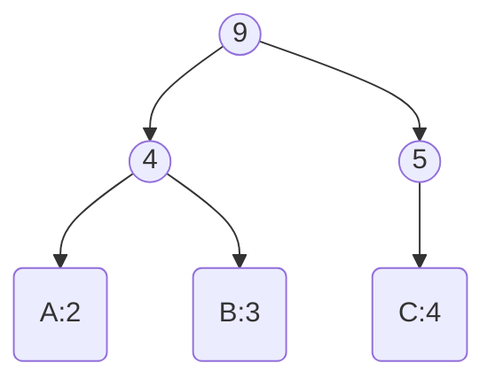
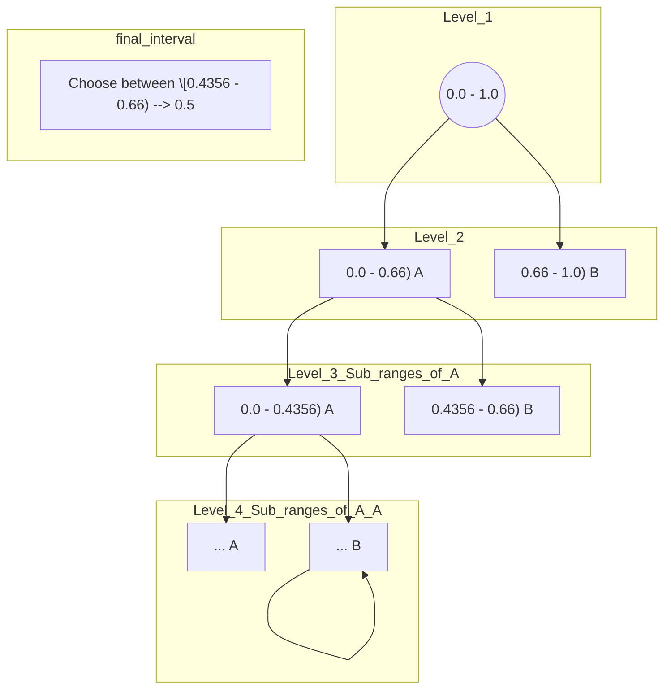

## 1. Run-Length Encoding (RLE)

**Description:**

Run-Length Encoding (RLE) is a simple form of lossless data compression in which runs of data (sequences in which the same data value occurs in many consecutive data elements) are stored as a single data value and count, rather than as the original run. This is most useful on data that contains many such runs.

**How it Works:**

RLE replaces consecutive occurrences of a symbol with a single instance of the symbol followed by the number of times it occurs.

**Mathematical Formulation:**

Let $S$ be a string of symbols. RLE transforms $S$ into a sequence of pairs $(s_i, c_i)$, where $s_i$ is the symbol and $c_i$ is the count of consecutive occurrences of $s_i$.

**Example:**

Consider the string `WWWWWWWWWWWWBWWWWWWWWWWWWBBBWWWWWWWWWWWWWWWWWWWWWWWWB`.

Using RLE, this can be compressed to `W12B1W12B3W24B1`.

**Advantages:**

*   Simple to implement.
*   Fast execution.
*   Effective for data with long runs of repeated symbols.

**Disadvantages:**

*   Ineffective for data without many runs.
*   Can actually increase the size of the data if there are no runs.

## 2. Dictionary-Based Compression (LZ77 / LZW / DEFLATE)

### LZ77

**Description:**

LZ77 is a lossless data compression algorithm that works by replacing repeated occurrences of data with references to a single copy of that data existing earlier in the uncompressed data stream.

**How it Works:**

LZ77 maintains a sliding window over the most recently seen data. The algorithm searches backward through a portion of already processed text (the "search buffer") to find a match for the current text (the "lookahead buffer"). If a match is found, the algorithm encodes the length and distance of the match.

**Mathematical Formulation:**

The LZ77 algorithm encodes data as a sequence of tuples $(o, l, c)$, where:

*   $o$ is the offset (distance) to the beginning of the matching string in the search buffer.
*   $l$ is the length of the matching string.
*   $c$ is the next symbol in the lookahead buffer after the matching string.

**Example:**

Consider the string `ABABCBABABA`.

1.  The algorithm starts with an empty search buffer.
2.  It encodes `A` as `(0, 0, A)`.
3.  It encodes `B` as `(0, 0, B)`.
4.  It encodes `ABC` as `(0, 0, C)`.
5.  It finds `BAB` matching the sequence starting at offset 2 with length 3, so it encodes `BAB` as `(2, 3, A)`.
6.  It finds `ABA` matching the sequence starting at offset 0 with length 3, so it encodes `ABA` as `(0, 3, )`.

The compressed sequence is `(0, 0, A)(0, 0, B)(0, 0, C)(2, 3, A)(0,3,)`.

**Advantages:**

*   Effective for data with repeating sequences.
*   Simple to implement.

**Disadvantages:**

*   Sliding window can be computationally expensive.
*   Compression ratio depends on the size of the sliding window.

### LZW

**Description:**

LZW (Lempel-Ziv-Welch) is a lossless data compression algorithm that builds a dictionary of strings during the encoding process. It is an improvement over LZ77 because it only stores dictionary indices, not explicit characters.

**How it Works:**

LZW starts with a dictionary containing single-character strings. As it reads the input, it looks for the longest string in the dictionary that matches the current input. It then outputs the index of that string in the dictionary and adds a new string to the dictionary, which is the matched string plus the next character in the input.

**Mathematical Formulation:**

The LZW algorithm encodes data as a sequence of dictionary indices. The dictionary is built dynamically during the encoding process.

**Example:**

Consider the string `ABABCBABABA`.

1.  The algorithm starts with a dictionary containing `A`, `B`, and `C`.
2.  It encodes `AB` as a new entry in the dictionary (e.g., index 4).
3.  It encodes `ABC` as a new entry in the dictionary (e.g., index 5).
4.  It encodes `BAB` as a new entry in the dictionary (e.g., index 6).
5.  It encodes `ABA` as a new entry in the dictionary (e.g., index 7).

The compressed sequence is the sequence of indices corresponding to these entries.

**Advantages:**

*   Effective for data with repeating sequences.
*   Simpler than LZ77.

**Disadvantages:**

*   Dictionary size can grow rapidly.
*   Requires a large initial dictionary.

### DEFLATE

**Description:**

DEFLATE is a lossless data compression algorithm that combines LZ77 and Huffman coding. It is used in many popular compression formats, such as gzip and ZIP.

**How it Works:**

DEFLATE first uses LZ77 to remove repeating sequences in the data. It then uses Huffman coding to compress the resulting data.

**Mathematical Formulation:**

DEFLATE combines the LZ77 tuple representation with Huffman coding. The output of LZ77 (offset, length, and literal symbols) are encoded using Huffman codes.

**Advantages:**

*   High compression ratio.
*   Widely used and well-supported.

**Disadvantages:**

*   More complex than LZ77 or LZW.
*   Can be slower than other compression algorithms.

---

## 3. Huffman Coding

**Description:**

Huffman coding is a lossless data compression algorithm that assigns variable-length codes to input characters based on their frequencies. More frequent characters are assigned shorter codes, and less frequent characters are assigned longer codes.

**How it Works:**

1.  Calculate the frequency of each symbol in the input data.
2.  Create a binary tree where each node represents a symbol and its frequency.
3.  Repeatedly merge the two nodes with the lowest frequencies until only one node (the root) remains.
4.  Assign codes to each symbol by traversing the tree from the root to the symbol, assigning 0 to left branches and 1 to right branches.

**Mathematical Formulation:**

Let $S = \{s_1, s_2, ..., s_n\}$ be the set of symbols, and let $f(s_i)$ be the frequency of symbol $s_i$. The Huffman code for symbol $s_i$ is a binary string $c(s_i)$ such that the expected code length is minimized.

The expected code length $L$ is given by:

$L = \sum_{i=1}^{n} f(s_i) * |c(s_i)|$

where $|c(s_i)|$ is the length of the code for symbol $s_i$.

**Example:**

Consider the string `AABBBCCCC`.

1.  Frequencies: A:2, B:3, C:4
2.  Huffman Tree:

3.  Codes: A: 10, B: 01, C: 1

The compressed string is `10100101011111`, which is 14 bits long, compared to the original 8 characters * 8 bits/character = 64 bits.

**Advantages:**

*   Simple to implement.
*   Optimal for symbol-wise coding.

**Disadvantages:**

*   Requires knowledge of symbol frequencies.
*   Can be inefficient for data with uniform symbol frequencies.
---

## 4. Arithmetic Coding

**Description:**

Arithmetic coding is a lossless data compression technique that encodes an entire message into a single number, an arbitrary-precision fraction $n$ where $(0.0 \le n < 1.0)$.

**How it Works:**

1.  Determine the probability of each symbol in the input data.
2.  Divide the interval \[0, 1) into subintervals proportional to the probabilities of the symbols.
3.  Recursively subdivide the subinterval corresponding to the first symbol in the message, based on the probabilities of the remaining symbols.
4.  The final subinterval represents the entire message.
5.  Choose a number within the final subinterval as the encoded message.

**Mathematical Formulation:**

Let $S = \{s_1, s_2, ..., s_n\}$ be the set of symbols, and let $p(s_i)$ be the probability of symbol $s_i$. The interval \[0, 1) is divided into subintervals of size $p(s_i)$.

The encoded message is a number $n$ within the final subinterval.

**Example (Encoding):**

Consider the string `AAB`. Notice the repetition of 'A'.

1.  Probabilities: A: 0.66, B: 0.34
2.  Interval \[0, 1) is divided into \[0, 0.66), \[0.66, 1) for A and B respectively.
3.  The first symbol is A, so we subdivide \[0, 0.66) into subintervals proportional to the probabilities of A and B.
4.  The second symbol is A again, so we further subdivide the subinterval corresponding to A.
5.  The third symbol is B, so we subdivide the subinterval corresponding to B.
6.  Choose a number within the final subinterval as the encoded message.  Let's say we choose 0.3 as our encoded message.

**Example (Decoding):**

Given the encoded message 0.3 and the probabilities A: 0.66, B: 0.34:

1.  Start with the interval \[0, 1).
2.  0.3 falls within \[0, 0.66), so the first symbol is A.
3.  Update the interval to \[0, 0.66).
4.  Divide \[0, 0.66) into \[0, 0.4356) for A and \[0.4356, 0.66) for B.
5.  0.3 falls within \[0, 0.4356), so the second symbol is A.
6.  Update the interval to \[0, 0.4356).
7.  Divide \[0, 0.4356) into subintervals for A and B. Since 0.3 will fall into the A subinterval, we know the next likely value is A, but since we know the string is AAB, we can deduce that the final value must be B.

**Advantages:**

*   Can achieve higher compression ratios than Huffman coding.
*   Effective for data with skewed symbol probabilities.

**Disadvantages:**

*   More complex than Huffman coding.
*   Requires arbitrary-precision arithmetic.

## 5. Transform-Based Compression (like JPEG and MPEG)

**Description:**

Transform-based compression is a lossy data compression technique that transforms the data into a different domain (e.g., the frequency domain) and then discards less important components.

**How it Works:**

1.  Transform the data into a different domain using a mathematical transform (e.g., Discrete Cosine Transform (DCT), Discrete Wavelet Transform (DWT)).
2.  Quantize the transformed coefficients, discarding less important components.
3.  Encode the quantized coefficients using entropy coding (e.g., Huffman coding, arithmetic coding).

**Mathematical Formulation:**

Let $x$ be the input data, and let $T$ be the transform. The transformed data $y$ is given by:

$y = T(x)$

The quantized data $y_q$ is given by:

$y_q = Q(y)$

where $Q$ is the quantization function.

The encoded data is then given by entropy coding $E(y_q)$.

**Example:**

JPEG compression uses the Discrete Cosine Transform (DCT) to transform image data into the frequency domain. The DCT coefficients are then quantized, discarding high-frequency components. The quantized coefficients are then encoded using Huffman coding.

**Advantages:**

*   High compression ratios.
*   Effective for images, audio, and video.

**Disadvantages:**

*   Lossy compression.
*   Can introduce artifacts into the data.
